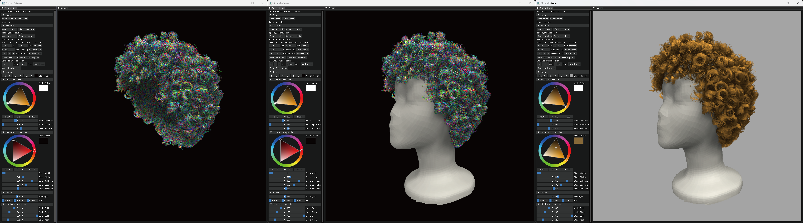

<p align="center">

  <h1 align="center">CT2Hair: High-Fidelity 3D Hair Modeling using Computed Tomography</h1>
  
  <p align="center" style="font-size:16px">
    <a href="https://jhonve.github.io/"><strong>Yuefan Shen</strong></a>
    ·
    <a href="https://shunsukesaito.github.io/"><strong>Shunsuke Saito</strong></a>
    ·
    <a href="https://ziyanw1.github.io/"><strong>Ziyan Wang</strong></a>
    ·
    <a href="https://www.linkedin.com/in/olivier-maury-7abaa0"><strong>Olivier Maury</strong></a>
    <br>
    <a href="https://sites.google.com/view/chengleiwu/"><strong>Chenglei Wu</strong></a>
    ·
    <a href="https://www.cs.cmu.edu/~jkh/"><strong>Jessica Hodgins</strong></a>
    ·
    <a href="https://youyizheng.net"><strong>Youyi Zheng</strong></a>
    ·
    <a href="https://sites.google.com/view/gjnam"><strong>Giljoo Nam</strong></a>
  </p>
  <p align="center" style="font-size:16px">ACM SIGGRAPH 2023 (ACM Transactions on Graphics)</p>

  <p align="center">
  <br>
    <a href='https://dl.acm.org/doi/10.1145/3592106'></a>
    <a href='https://youtu.be/GdvxgsITZOw'></a>
    <a href='https://jhonve.github.io/CTHair' style='padding-left: 0.5rem;'></a>
  </p>
  <div align="center">
  </div>

  <br/>
  <p>This repository contains the code and data that are associated with the paper "CT2Hair: High-Fidelity 3D Hair Modeling using Computed Tomography". CT2Hair is a fully automatic framework for creating high-fidelity 3D hair models that are suitable for use in downstream graphics applications. Our approach utilizes real-world hair wigs as input and is able to reconstruct hair strands for a wide range of hairstyles. Our method leverages computed tomography (CT) to create density volumes of the hair regions, allowing us to see through the hair, unlike image-based approaches which are limited to reconstructing the visible surface.</p>
</p>


## Data
### [CT scan data](https://fb-baas-f32eacb9-8abb-11eb-b2b8-4857dd089e15.s3.amazonaws.com/CT2Hair/data.zip) (7.2GB) | [3D hair models](https://fb-baas-f32eacb9-8abb-11eb-b2b8-4857dd089e15.s3.amazonaws.com/CT2Hair/output.zip) (248MB)

Here is an overview image of our dataset. We have 10 samples with different hairstyles.


The CT scan data contains the following files: template head models, scalp points and vbd volumes for 10 samples. The data folder has the following structure.
```shell
data
├── HeadModels
│   ├── MannequinHeadA/
│   └── MannequinHeadB/
└── ScalpPoints
│   ├── scalp_xxx_pts.ply
│   └── ...
└── VDBs
    └── Clipped
        ├── xxx_clipped.vdb
        └── ...
```

The 3D hair models have 10 .bin files. The data structure of .bin files can be seen [here](https://github.com/facebookresearch/CT2Hair/blob/main/CT2Hair/datautils/datautils.py#L118-L155). You can also open the .bin files with our visualizer.


## Requirements
- Hardware: NVIDIA GPU (24G memory or larger), 64G RAM or larger.
- Environments: Ubuntu 22.04 (> 20.04) or Windows 10/11, CUDA 11.5 (> 11.0), Python 3.10, PyTorch 1.11 (>1.10).

## Compilation (C++ & CUDA)
### Linux
Install dependencies. Take Ubuntu as an example.
```shell
# Dependencies
apt install libeigen3-dev
apt install libpcl-dev
apt install libflann-dev
```
For the [OpenVDB](https://www.openvdb.org/) library, we recommend building it from the source code to avoid some known issues. Please refer to [their GitHub repo](https://github.com/AcademySoftwareFoundation/openvdb).

```shell
cd CT2Hair/GuideHairStrands

# Please add your OpenVDB and CUDA path in CMakeLists.txt.
------------------------------------
7 set(CUDAPATH $CUDA_path)
8 set(OPENVDBPATH $OpenVDB_lib_path)
------------------------------------

mkdir build && cd build
cmake ..
make -j
```

### Windows
We strongly recommend using [vcpkg](https://vcpkg.io) to manage most of your third-party libraries on Windows. Please install [vcpkg](https://vcpkg.io/en/getting-started.html) first, and go to the `vcpkg` folder to install the following dependencies.

```shell
# Dependencies
vcpkg.exe install eigen3:x64-windows
vcpkg.exe install pcl:x64-windows
vcpkg.exe install flann:x64-windows
```
For the [OpenVDB](https://www.openvdb.org/) library, we recommend building it from the source code to avoid some known issues. Please refer to [their GitHub repo](https://github.com/AcademySoftwareFoundation/openvdb).

```shell
cd CT2Hair/GuideHairStrands

# Please add your OpenVDB and CUDA path in CMakeLists.txt.
-------------------------------------
20 set(CUDAPATH $CUDA_path)
21 set(VCPKGPATH $VCPKG_path)
22 set(OPENVDBPATH $OpenVDB_lib_path)
-------------------------------------

mkdir build
cd build
cmake .. -DCMAKE_TOOLCHAIN_FILE=$VCPKG_path\scripts\buildsystems\vcpkg.cmake -DVCPKG_TARGET_TRIPLET=x64-windows -DCMAKE_POLICY_DEFAULT_CMP0091=NEW
cmake --build . --config release
cmake --install .
```
Note that you have to make sure you already install CUDA and its corresponding Visual Studio extension correctly. If you have multiple versions of Visual Studio, please choose the one that has the corresponding extension with your installed CUDA. For example, if you are using CUDA 11.5 and Visual Studio 2019 (VS 2022 requires CUDA 11.6 at least), please add `-G "Visual Studio 16 2019"` to your first cmake command.

## Running
Our code contains the entire pipeline of reconstructing strands from the input density volume. We have four scripts for four corresponding steps in our pipeline. We have set config files for each sample in `conf/data/`.

### Setup
```shell
# Create and activate a virtual environment
conda env create --file CT2Hair/environment.yml
conda activate ct2hair
```

### Commands
```shell
# Estimate 3D orientations
python scripts/est_orientations.py --conf $configure_file --datapath $path_to_data
# This will generate a point cloud with color encoding the estimated orientations, named as "*_oriens_*.ply".

# Generate guide hair strands
python scripts/gen_guide_strands.py --conf $configure_file --datapath $path_to_data
# This will generate guide hair strands file named as "*_guide.bin*.

# Interpolate empty regions
python scripts/interpolation.py --conf $configure_file --datapath $path_to_data
# This will generate hair strands file after interpolation named as "*_merged.bin".

# Optimize hair strands to fit the CT volume
python scripts/optimization.py --conf $configure_file --datapath $path_to_data
# This will generate hair strands file after optimization named as "*_opted.bin". This step usually takes hours for each case.
```

## Visualization
We can use a simple visualization tool for hair strands. Users can directly use the interface to load our generated hair strands files (`*.bin` or `.data` files). Please refer to [HairStrandsRendering](https://github.com/Jhonve/HairStrandsRendering) for more details.


For volume visualization (`.vdb`), we suggest using [Houdini](https://www.sidefx.com/) or [Blender](https://www.blender.org/). Here is a [tutorial example](https://www.youtube.com/watch?v=40qmkj2pPso) for importing and shading `.vdb` files in Blender.

## License
Creative Commons Attribution-NonCommercial (CC BY-NC) 4.0.

## BibTeX
```bibtex
@article{shen2023CT2Hair,
  title={CT2Hair: High-Fidelity 3D Hair Modeling using Computed Tomography},
  author={Shen, Yuefan and Saito, Shunsuke and Wang, Ziyan and Maury, Olivier and Wu, Chenglei and Hodgins, Jessica and Zheng, Youyi and Nam, Giljoo},
  journal={ACM Transactions on Graphics},
  volume={42},
  number={4},
  articleno={75},
  pages={1--13},
  year={2023},
  publisher={ACM New York, NY, USA}
}
```
